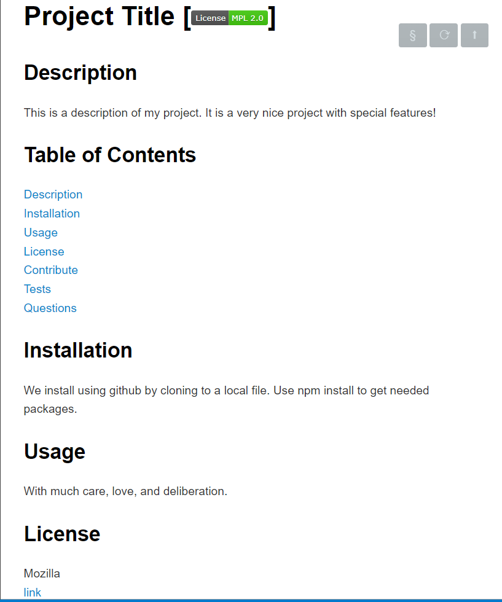

# README Maker

## Description 

This Application creates a quality read me using command line input from a user. It inserts user information into the newly created or currently existing read me in the location specified.
 
It was created using node.js with Inquirer and fs.

[Video-Link](https://drive.google.com/file/d/1ZQ-9gBOvRB7fGhmEn_fLxczWEp6jD9MC/view)

## Table of Contents 

[Description](#description)
[Installation](#installation)
[Usage](#usage)
[License](#license)
[Contribute](#contribute)
[Tests](#tests)
[Questions](#questions)
 
## Installation

To install README Maker, copy the github repository link, and clone down the repository in desired folder. Use NPM install to install Inquirer and fs.

## Usage

THis Application would be used to create quality READMEs for developers.

## License

No license used

## Contribute

This Application doesn't accept contributions.

## Tests

I used many tests to make this app

## Questions

GitHub: [Elenalaree](https://github.com/elenalaree)

